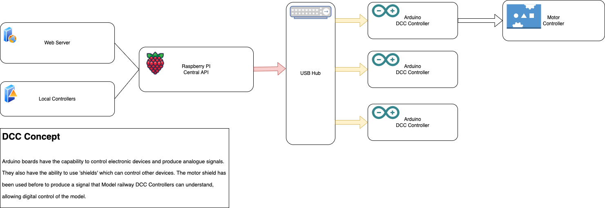

# Digital Model Railway Controller

## Problem

There are already Arduino boards working as DCC controllers, but I want to build something myself that I understand and can learn more about DCC, Arduino and Python

## Planned Solution

